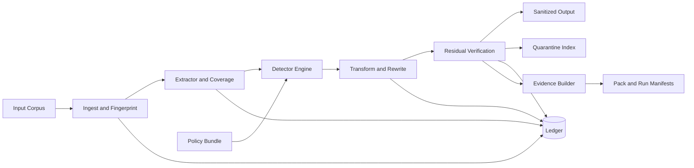

# VeilPack

[](https://github.com/aliuyar1234/VeilPack/actions/workflows/ci.yml)


VeilPack is an offline, fail-closed privacy gate for enterprise data pipelines. It ingests mixed corpora, detects sensitive values using policy-defined detectors, rewrites outputs, and emits a verifiable pack that is safe to move downstream.

## Table of Contents
- [Why VeilPack](#why-veilpack)
- [Who It Is For](#who-it-is-for)
- [What You Get](#what-you-get)
- [High-Level Architecture](#high-level-architecture)
- [How Processing Works](#how-processing-works)
- [Supported Input Formats](#supported-input-formats)
- [CLI Overview](#cli-overview)
- [Quickstart](#quickstart)
- [Worked Example (CSV)](#worked-example-csv)
- [Worked Example (PDF)](#worked-example-pdf)
- [Output Layout](#output-layout)
- [Exit Codes](#exit-codes)
- [Development and Quality Gates](#development-and-quality-gates)
- [Repository Structure](#repository-structure)
- [Project Notes](#project-notes)

## Why VeilPack
- Reduces data-sharing risk by defaulting to strict, deterministic sanitization.
- Enforces a fail-closed model: each artifact ends `VERIFIED` or `QUARANTINED`.
- Keeps runtime offline-first for air-gapped and regulated environments.
- Produces audit-friendly evidence without plaintext sensitive values.

## Who It Is For
- Security and privacy engineering teams that need enforceable data sanitization.
- Data platform teams that need repeatable, policy-driven preprocessing.
- ML and analytics teams that need safer corpora before training or sharing.
- Compliance-focused orgs that need deterministic outputs and verifiable controls.

## What You Get
- A Rust workspace with clear layer boundaries (`domain -> policy -> extract -> detect -> transform -> verify -> evidence -> cli`).
- A production-style CLI:
  - `veil run`
  - `veil verify`
  - `veil policy lint`
- Built-in checks for offline enforcement, boundary fitness, and contract consistency.
- A deterministic Veil Pack output contract (`pack.v1` + `ledger` schema binding).

## High-Level Architecture


### Layer-to-crate mapping
| Layer | Crate | Responsibility |
|---|---|---|
| Domain | `crates/veil-domain` | IDs, invariants, shared config/hashing primitives |
| Policy | `crates/veil-policy` | Policy schema parsing, validation, policy identity |
| Extract | `crates/veil-extract` | Format parsing, canonical representation, coverage |
| Detect | `crates/veil-detect` | Matching engine (regex/checksum/selectors) |
| Transform | `crates/veil-transform` | Deterministic redact/mask/drop rewrites |
| Verify | `crates/veil-verify` | Residual safety verification decisions |
| Evidence | `crates/veil-evidence` | Ledger and non-sensitive evidence persistence |
| CLI | `crates/veil-cli` | Orchestration, pack emission, command surface |

## How Processing Works
1. Discover artifacts and fingerprint content deterministically.
2. Extract to canonical representation with explicit coverage metadata.
3. Detect sensitive findings using compiled policy detectors.
4. Apply transforms (for example `REDACT`, `MASK`, `DROP`).
5. Re-scan transformed output (residual verification).
6. Emit `VERIFIED` outputs only when residual checks pass; otherwise quarantine.
7. Persist evidence and manifests with no plaintext sensitive values.

### Terminal state model
- `VERIFIED`: artifact passed strict coverage and residual verification.
- `QUARANTINED`: artifact is withheld with a non-sensitive reason code.

## Supported Input Formats
| Group | Types |
|---|---|
| Text and structured | `.txt`, `.csv`, `.tsv`, `.json`, `.ndjson` |
| PDF | `.pdf` (default output: canonical NDJSON; optional `safe_pdf` output mode; image-only pages use optional local OCR via `limits.v1` `pdf.ocr.*`; fail-closed quarantine when OCR is required but unavailable/failing) |
| Container and compound | `.zip`, `.tar`, `.eml`, `.mbox`, `.docx`, `.pptx`, `.xlsx` |

Notes:
- Container parsing is strict by extension contract.
- Mislabeled container payloads are quarantined (`PARSE_ERROR`).
- Container-origin sanitized outputs are canonical NDJSON.

## CLI Overview
```text
veil run --input <PATH> --output <PATH> --policy <PATH> [FLAGS]
veil verify --pack <PATH> --policy <PATH>
veil policy lint --policy <PATH>
```

Key `run` flags:
- `--workdir <PATH>`
- `--max-workers <N>` (accepted; v1 baseline executes deterministic single-worker)
- `--strictness strict`
- `--enable-tokenization true|false`
- `--secret-key-file <PATH>`
- `--quarantine-copy true|false`
- `--limits-json <PATH>`

## Quickstart
### Prerequisites
- Rust stable toolchain
- Python 3

### Build and test
```bash
cargo build --workspace
cargo test --workspace
```

### Create a minimal policy bundle
Create `policy/policy.json`:

```json
{
  "schema_version": "policy.v1",
  "classes": [
    {
      "class_id": "PII.Test",
      "severity": "HIGH",
      "detectors": [
        {
          "kind": "regex",
          "pattern": "SECRET"
        }
      ],
      "action": {
        "kind": "REDACT"
      }
    }
  ],
  "defaults": {},
  "scopes": []
}
```

### Run sanitization
```bash
cargo run -p veil-cli -- run \
  --input ./input \
  --output ./out \
  --policy ./policy
```

### Verify an emitted pack
```bash
cargo run -p veil-cli -- verify \
  --pack ./out \
  --policy ./policy
```

### Lint a policy bundle
```bash
cargo run -p veil-cli -- policy lint --policy ./policy
```

## Worked Example (CSV)
Use the committed end-to-end demo under `examples/csv-redaction`:

- walkthrough: `examples/csv-redaction/README.md`
- input corpus: `examples/csv-redaction/input/customers.csv`
- policy: `examples/csv-redaction/policy/policy.json`
- expected sanitized content: `examples/csv-redaction/expected/customers.sanitized.csv`

Run it:

```bash
cargo run -p veil-cli -- run \
  --input examples/csv-redaction/input \
  --output examples/csv-redaction/out \
  --policy examples/csv-redaction/policy
```

Then inspect:

```bash
cat examples/csv-redaction/out/sanitized/*.csv
```

This demo is also enforced by integration test:
`cargo test -p veil-cli --test examples_csv_demo`

## Worked Example (PDF)
Use the committed end-to-end demo under `examples/pdf-redaction`:

- walkthrough: `examples/pdf-redaction/README.md`
- input corpus: `examples/pdf-redaction/input/invoice.pdf`
- policy: `examples/pdf-redaction/policy/policy.json`
- expected sanitized content: `examples/pdf-redaction/expected/invoice.sanitized.ndjson`

Run it:

```bash
cargo run -p veil-cli -- run \
  --input examples/pdf-redaction/input \
  --output examples/pdf-redaction/out \
  --policy examples/pdf-redaction/policy
```

Then inspect:

```bash
cat examples/pdf-redaction/out/sanitized/*.ndjson
```

This demo is also enforced by integration test:
`cargo test -p veil-cli --test examples_pdf_demo`

### Enable local OCR for scanned PDFs
OCR remains strictly local and opt-in. Configure it via `--limits-json`:

```json
{
  "schema_version": "limits.v1",
  "pdf": {
    "output_mode": "derived_ndjson",
    "worker": {
      "enabled": true,
      "timeout_ms": 60000,
      "max_output_bytes": 67108864
    },
    "ocr": {
      "enabled": true,
      "command": ["python", "tools/pdf_ocr_worker.py"],
      "timeout_ms": 30000,
      "max_output_bytes": 1048576
    }
  }
}
```

PDF mode values:
- `pdf.output_mode = "derived_ndjson"` (default): sanitized artifact remains NDJSON.
- `pdf.output_mode = "safe_pdf"`: Veil emits a deterministic, structurally minimal sanitized PDF.

Runtime OCR command contract:
- `stdin`: raw PDF bytes
- `stdout`: UTF-8 extracted text for the current page
- env vars: `VEIL_PDF_OCR_PAGE_INDEX`, `VEIL_PDF_OCR_PAGE_NUMBER`, `VEIL_ARTIFACT_ID`, `VEIL_SOURCE_LOCATOR_HASH`

## Output Layout
`veil run` writes:

```text
<pack_root>/
  sanitized/
  quarantine/
    index.ndjson
    raw/                     # present only when --quarantine-copy=true
  evidence/
    run_manifest.json
    artifacts.ndjson
    ledger.sqlite3
  pack_manifest.json
```

## Exit Codes
| Code | Meaning |
|---|---|
| `0` | Run completed and all artifacts are `VERIFIED` |
| `2` | Run completed with one or more `QUARANTINED` artifacts |
| `1` | Fatal error |
| `3` | Invalid arguments or invalid policy bundle |

## Development and Quality Gates
```bash
cargo fmt --all -- --check
cargo clippy --workspace -- -D warnings
cargo test --workspace
python checks/offline_enforcement.py
python checks/boundary_fitness.py
python checks/ssot_validate.py all
python checks/perf_harness.py --build
```

## Repository Structure
```text
crates/
  veil-cli/
  veil-domain/
  veil-policy/
  veil-extract/
  veil-detect/
  veil-transform/
  veil-verify/
  veil-evidence/
checks/
.github/workflows/ci.yml
Cargo.toml
```

## Project Notes
- This repository currently does not declare an open-source license file.
- Internal SSOT/session documentation is intentionally kept local and out of the implementation repository history.
